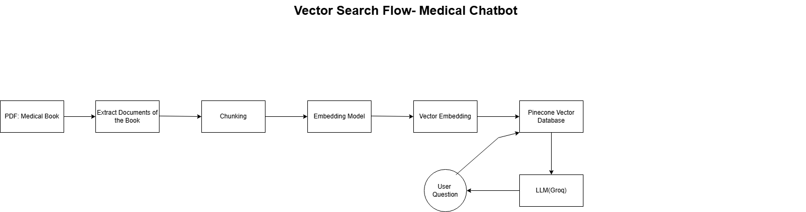
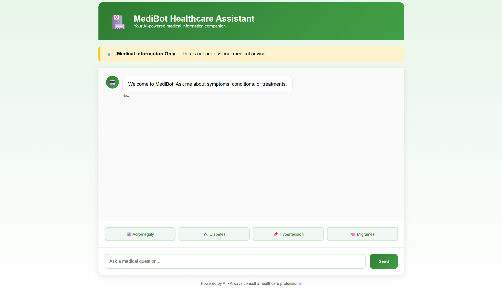
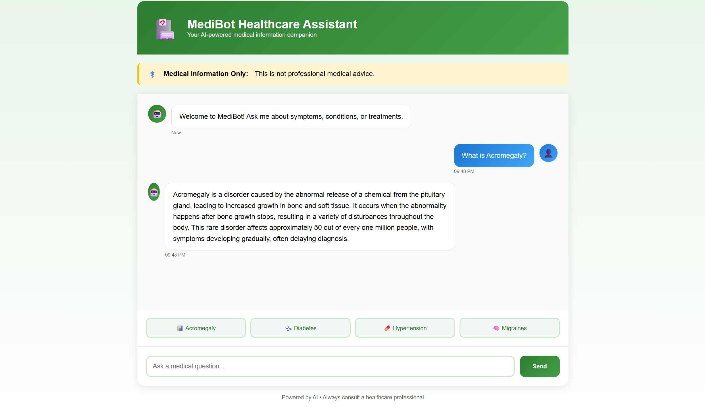
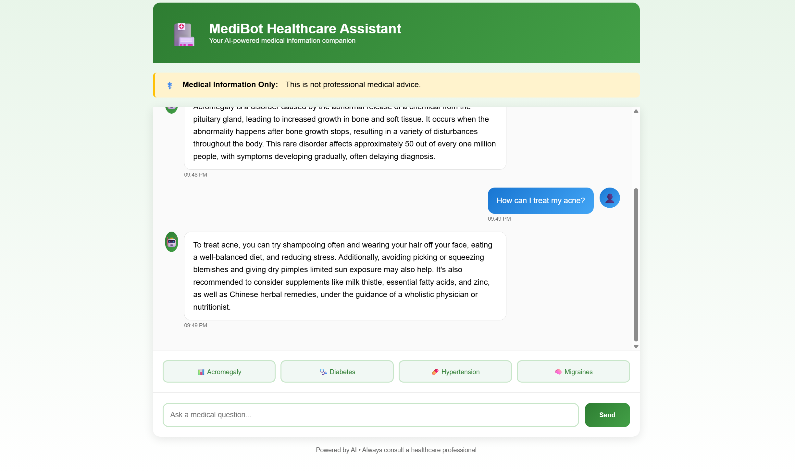

# 🩺 Medical Chatbot


---

## 🚀 Overview
**Medical Chatbot** is an AI-powered assistant designed to answer medical-related questions using PDFs as a source of truth. It combines **vector search**, **retrieval-augmented generation (RAG)**, and **large language models** to provide concise, context-aware answers.  

This project demonstrates **full-stack AI engineering, scalable deployment, and modular code design** — perfect for showcasing technical skills to recruiters.

---

## 🛠️ Tech Stack

- **Frontend:** HTML, CSS, Flask Templates  
- **Backend:** Python, Flask, LangChain  
- **AI & NLP:** Groq LLM, HuggingFace Embeddings  
- **Vector Storage:** Pinecone  
- **Document Processing:** PyPDFLoader, RecursiveCharacterTextSplitter  
- **DevOps / Deployment:** Vercel, Docker ,AWS(EC2, IAM, ECR)
- **Other Tools:** Git, GitHub Actions, Python-dotenv  

---

## ✨ Features

- **Context-Aware Q&A:** Retrieves relevant information from uploaded PDF medical documents.  
- **RAG Pipeline:** Combines vector search and Groq LLM to generate accurate answers.  
- **Vector Storage:** Pinecone ensures fast, scalable similarity search.  
- **Document Loader:** Processes multiple PDFs dynamically.  
- **Lightweight Deployment:** Optimized for serverless deployment.  

---

## 🗂️ Vector Search Flow

## 💻 Screenshots / Demo

- **Chat Interface:**  
 

- **Example Q&A:**  




---

## 🧠 What I Learned

- **Full-Stack AI Integration:** Connecting document retrieval, embeddings, vector DBs, and LLMs.  
- **Vector Databases:** Hands-on experience with Pinecone for similarity search.  
- **Prompt Engineering:** Crafting prompts for accurate, concise responses.  
- **Cloud Deployment:** Serverless optimization on Vercel.  
- **Modular Coding:** Reusable helper modules and RAG chain design.  

---

## ⚡ Getting Started

```bash
# Clone repository
git clone https://github.com/melissa-aoko/Medical-Chatbot.git

# Navigate into project
cd Medical-Chatbot

# Install dependencies
pip install -r requirements.txt

# Set environment variables
export PINECONE_API_KEY="your_pinecone_key"
export GROQ_API_KEY="your_groq_key"

# Run locally
python app.py
